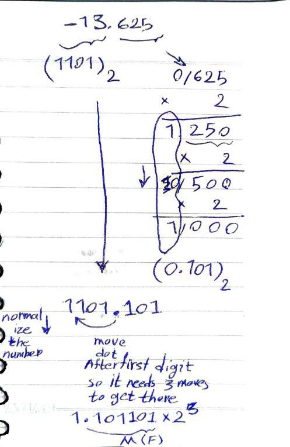

## 🔖 Note :

#### In C for declaration you need allocation first

##### so you need to allocate memory first for declaring variables

---

#### Integer types :

| Type      | Size               |
| --------- | ------------------ |
| char      | 1 byte             |
| short     | 2 bytes            |
| int       | 4 bytes            |
| long      | 4 bytes or 8 bytes |
| long long | 8 bytes            |

#### Floating point types :

| Type        | Size                 |
| ----------- | -------------------- |
| float       | 4 bytes              |
| double      | 8 bytes              |
| long double | 10 bytes or 16 bytes |

#### Pointer types :

| Type    | Size                                                          |
| ------- | ------------------------------------------------------------- |
| pointer | 4 bytes(32-bit systems) <br> or <br> 8 bytes( 64-bit systems) |

| Pointer Type | Size (32-bit) | Size (64-bit) |
| ------------ | ------------- | ------------- |
| char \*      | 4 bytes       | 8 bytes       |
| short \*     | 4 bytes       | 8 bytes       |
| int \*       | 4 bytes       | 8 bytes       |
| long \*      | 4 bytes       | 8 bytes       |
| float \*     | 4 bytes       | 8 bytes       |
| double \*    | 4 bytes       | 8 bytes       |
| void \*      | 4 bytes       | 8 bytes       |

#### Array types :

| Type        | Size                    |
| ----------- | ----------------------- |
| int arr[10] | 40 bytes (10 x 4 bytes) |

#### Structure types :

| Type            | Size                |
| --------------- | ------------------- |
| struct MyStruct | 7 bytes (4 + 1 + 2) |

#### Output:

Size of char: 1 bytes
Size of short: 2 bytes
Size of int: 4 bytes
Size of long: 4 bytes
Size of long long: 8 bytes
Size of float: 4 bytes
Size of double: 8 bytes
Size of long double: 16 bytes
Size of pointer: 8 bytes
Size of array: 40 bytes
Size of structure: 8 bytes

<h1 align= "center">$\textcolor{yellow}{More\ Details\ }$
</h1>

1 byte = 8 bits
Binary representation of 255: 11111111

    2^7 (128) + 2^6 (64) + 2^5 (32) + 2^4 (16) + 2^3 (8) + 2^2 (4) + 2^1 (2) + 2^0 (1) = 255

or in simple way :
255 => 2^8 - 1

- 2^8 represents the total number of possible values that can be represented by 8 bits (2 to the power of 8).
- However, since we start counting from 0, we need to subtract 1 to get the maximum value.

so the maximom number value that can be fit into the 1 byte is 255

- char c = 127; (positive value)

  - Sign bit: 0
  - Magnitude bits: 01111111 (127) => 2^7 - 1 = 127

- char c = -128; (negative value)
  - Sign bit: 1
  - Magnitude bits: 10000000 ( inverted and added 1)

And the Minimom Negative Number is -128

char c maximomValue = 127
and minimomValue = -128
| Type | Minimum Value | Maximum Value |
| --- | --- | --- |
| char (signed) | -128 | 127 | | char (unsigned) | 0 | 255 |
| unsigned char | 0 | 255 |
| summery | -128 | 255 |

---

Short maximom and minimom value calculation :
A short type is 16 bits long.
Since short is a signed type, 1 bit is used for the sign.
The remaining 15 bits are used for the magnitude.
2^15 - 1 = 32767

Calculate the minimum value
Since 1 bit is used for the sign, the minimum value is:

    -2^15 = -32768

For an unsigned short type, all 16 bits are used for the magnitude, so the maximum value is:

    2^16 - 1 = 65535

The minimum value for an unsigned short type is 0.

Short maximom and minimom value
| Type | Minimum Value | Maximum Value |
| --- | --- | --- |
| short (signed) | -32768 | 32767 |
| unsigned short | 0 | 65535 |
| summery | -32768 | 65535 |

---

### int type :

- int: 4 bytes (32 bits)
- Maximum value: 2^31 - 1 = 2147483647
- Minimum value: -2^31 = -2147483648

| Type           | Minimum Value | Maximum Value |
| -------------- | ------------- | ------------- |
| int (signed)   | -2147483648   | 2147483647    |
| int (unsigned) | 0             | 4294967295    |
| summery        | -2147483648   | 4294967295    |

---

### float type :

- float: 4 bytes (32 bits)
- Minimum value: approximately 1.175494351e-38
- e-38 part means that the number should be multiplied by 10 to the power of -38.
- 0.00000000000000000000000000000000000001175494351 = 1.175494351e-38
- Maximum value: approximately 3.402823466e+38
- so float type can store larger numbers than the int type. albeit with some loss of precision due to the binary representation
- 🔖 Keep in mind that the float type is not suitable for storing large integers, as it will lose precision and may not be able to represent the exact value. For large integers, you may want to use a larger integer type, such as long long or a library that supports arbitrary-precision arithmetic.

##### Understand the IEEE 754 floating-point representation :

In the IEEE 754 floating-point representation, a 32-bit float is divided into 3 parts:

- Sign bit (1 bit): indicates whether the number is positive or negative
- Exponent (8 bits): represents the power of 2 to which the mantissa should be raised
- Mantissa (23 bits): represents the fractional part of the number

| Sign bit (1 bit) | Exponent (8 bits) | Mantissa (23 bits)                              |
| ---------------- | ----------------- | ----------------------------------------------- |
| 0/1              | 00000000-11111111 | 00000000000000000000000-11111111111111111111111 |

| Type  | Minimum Value                 | Maximum Value                 |
| ----- | ----------------------------- | ----------------------------- |
| float | approximately 1.175494351e-38 | approximately 3.402823466e+38 |

The IEEE 754 standard is a widely used standard for floating-point arithmetic in computing. It defines how floating-point numbers are represented, stored, and manipulated in binary form.

---

## **Key Concepts of IEEE 754**

1. **Floating-Point Representation**:

   - Floating-point numbers are represented in three parts:
     - **Sign bit**: Determines whether the number is positive or negative.
     - **Exponent**: Represents the power of 2 to which the number is raised.
     - **Mantissa (Significand)**: Represents the fractional part of the number.

2. **Formats**:
   - IEEE 754 defines several formats, but the most common are:
     - **Single Precision (32-bit)**: Used in most applications.
     - **Double Precision (64-bit)**: Used for higher precision.

---

## **IEEE 754 Single Precision (32-bit) Format**

| **Component** | **Sign Bit** | **Exponent (8 bits)** | **Mantissa (23 bits)** |
| ------------- | ------------ | --------------------- | ---------------------- |
| **Size**      | 1 bit        | 8 bits                | 23 bits                |

- **Total Bits**: 1 (sign) + 8 (exponent) + 23 (mantissa) = 32 bits.

### **1. Sign Bit**:

- **0**: Positive number.
- **1**: Negative number.

### **2. Exponent**:

- The exponent is stored in **biased form** to handle both positive and negative exponents.
- **Bias**: 127 for single precision.
- The actual exponent is calculated as:  
  \[
  \text{Exponent} = \text{Exponent Field (binary)} + \text{Bias}
  \]

### **3. Mantissa**:

- The mantissa represents the fractional part of the number.
- It is normalized to have a leading 1 (implicit), so only the fractional part is stored.

---

## **IEEE 754 Double Precision (64-bit) Format**

| **Component** | **Sign Bit** | **Exponent (11 bits)** | **Mantissa (52 bits)** |
| ------------- | ------------ | ---------------------- | ---------------------- |
| **Size**      | 1 bit        | 11 bits                | 52 bits                |

- **Total Bits**: 1 (sign) + 11 (exponent) + 52 (mantissa) = 64 bits.
- **Bias**: 1023 for double precision.

---

## **Example: Single Precision Representation**

Let’s represent the decimal number `-13.625` in IEEE 754 single precision format.

### **Step 1: Convert to Binary**

- **Integer part (13)**:
  \[
  13\_{10} = 1101_2
  \]
- **Fractional part (0.625)**:
  \[
  0.625\_{10} = 0.101_2
  \]
- **Combined**:
  \[
  13.625\_{10} = 1101.101_2
  \]

### **Step 2: Normalize**

- Move the binary point to the left until there is only one non-zero digit to the left:
  \[
  1101.101_2 = 1.101101_2 \times 2^3
  \]
- **Exponent**: 3 (since the binary point was moved 3 places to the left).

### **Step 3: Encode the Sign, Exponent, and Mantissa**

- **Sign bit**: `1` (negative number).
- **Exponent**: Add bias (127) to the exponent:
  \[
  3 + 127 = 130\_{10} = 10000010_2
  \]
- **Mantissa**: Drop the leading 1 and store the fractional part:
  \[
  1.101101_2 \rightarrow 10110100000000000000000_2
  \]

### **Step 4: Combine**

- **Final Representation**:
  \[
  1\ \ 10000010\ \ 10110100000000000000000
  \]
  (Sign | Exponent | Mantissa)

---

## **Special Cases in IEEE 754**

1. **Zero**:

   - Sign bit: 0 or 1.
   - Exponent: All zeros.
   - Mantissa: All zeros.

2. **Infinity**:

   - Sign bit: 0 or 1.
   - Exponent: All ones.
   - Mantissa: All zeros.

3. **NaN (Not a Number)**:
   - Exponent: All ones.
   - Mantissa: Non-zero.

---

## **Visualization of IEEE 754 Single Precision**

Imagine a 32-bit binary number divided into three parts:

```

| S | Exponent (8 bits) | Mantissa (23 bits) |

```

For the example `-13.625`:

```

| 1 | 10000010 | 10110100000000000000000 |

```

### two images for more details also:




---

## **Summary**

- IEEE 754 is the standard for floating-point representation in computers.
- It uses a sign bit, biased exponent, and normalized mantissa.
- Single precision (32-bit) and double precision (64-bit) are the most common formats.
- Special cases like zero, infinity, and NaN are also defined.

Watch this well detailed youtube video if you need it :
[for more datails](https://youtu.be/aKp4nrhnTJg?si=XBbnzjm27ja3K80T)

Here's an explanation of Pointers, Array types, and Structure types in C, along with tables in Markdown format:

# **Pointers**

A pointer is a variable that stores the **memory address** of another variable.

### Pointer Declaration

- `int *ptr;` declares a pointer to an integer.
- `char *ptr;` declares a pointer to a character.

### Pointer Operations

| Operation | Description                                                         |
| --------- | ------------------------------------------------------------------- |
| `&`       | Address-of operator. Returns the memory address of a variable.      |
| `*`       | Dereference operator. Returns the value stored at a memory address. |

### Pointer Example

```c
int main() {
    int var = 10;
    int *ptr = &var;  // declare and initialize a pointer

    printf("Value of var: %d\n", var);
    printf("Address of var: %p\n", (void *)&var);
    printf("Value of ptr: %p\n", (void *)ptr);
    printf("Value at address ptr: %d\n", *ptr);

    return 0;
}
```

##### 🔖 so by default the ptr stores the address of var

# **Array Types**

An array is a collection of elements of the same data type stored in contiguous memory locations(a block of memory where each element is stored one after the other, without any gaps or holes in between).

### Array Declaration

- `int arr[5];` declares an array of 5 integers.
- `char arr[10];` declares an array of 10 characters.

### Array Operations

| Operation | Description                                           |
| --------- | ----------------------------------------------------- |
| `arr[0]`  | Access the first element of the array.                |
| `arr[4]`  | Access the fifth element of the array (last element). |

### Array Example

```c
int main() {
    int arr[5] = {1, 2, 3, 4, 5};  // declare and initialize an array

    printf("First element: %d\n", arr[0]);
    printf("Last element: %d\n", arr[4]);

    return 0;
}
```

# **Structure Types**

A structure is a collection of elements of different data types stored in contiguous memory locations.

### Structure Declaration

```c
struct Person {
    int age;
    char name[20];
};
```

### Structure Operations

| Operation          | Description                                |
| ------------------ | ------------------------------------------ |
| `struct Person p;` | Declare a structure variable.              |
| `p.age`            | Access the `age` member of the structure.  |
| `p.name`           | Access the `name` member of the structure. |

### Structure Example

```c
struct Person {
    int age;
    char name[20];
};

int main() {
    struct Person p;  // declare a structure variable

    p.age = 25;
    strcpy(p.name, "John");

    printf("Age: %d\n", p.age);
    printf("Name: %s\n", p.name);

    return 0;
}
```

---

Memory Layout Summary
| Concept | Memory Layout |
| --- | --- |
| Array | Contiguous memory locations |
| Structure | Contiguous memory locations |
| Pointer | Stores memory address of another variable |

---

C Language Types Summary
| Type | Description | Size (32-bit) | Size (64-bit) | Min Value | Max Value |
| --- | --- | --- | --- | --- | --- |
| char | Character | 1 byte | 1 byte | -128 | 127 |
| unsigned char | Unsigned character | 1 byte | 1 byte | 0 | 255 |
| short | Short integer | 2 bytes | 2 bytes | -32,768 | 32,767 |
| unsigned short | Unsigned short integer | 2 bytes | 2 bytes | 0 | 65,535 |
| int | Integer | 4 bytes | 4 bytes | -2,147,483,648 | 2,147,483,647 |
| unsigned int | Unsigned integer | 4 bytes | 4 bytes | 0 | 4,294,967,295 |
| long | Long integer | 4 bytes | 8 bytes | -2,147,483,648 | 2,147,483,647 |
| unsigned long | Unsigned long integer | 4 bytes | 8 bytes | 0 | 4,294,967,295 |
| float | Floating-point number | 4 bytes | 4 bytes | 1.175494e-38 | 3.402823e+38 |
| double | Double-precision floating-point number | 8 bytes | 8 bytes | 2.225073858507201e-308 | 1.797693134862315e+308 |
| long double | Long double-precision floating-point number | 10 bytes | 16 bytes | 3.362103143112093506e-4932 | 1.189731495357231765e+4932 |
| pointer | Memory address | 4 bytes | 8 bytes | N/A | N/A |

I hope this summary table is helpful! <3
